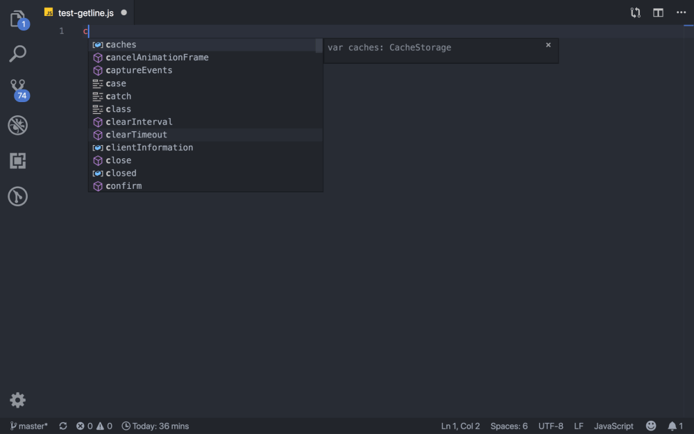

# Insert Console.log Line Number

## Features
ปัญหาเวลา debug ด้วย console.log หาไม่เจอว่าพิมพ์ไว้ตรงบรรทัดไหน หรือเยอะจนลืมลบ ทำให้ต้องเสียเวลามานั่งไล่หาทั้งไฟล์ ว่าข้อมูลที่แสดงออกมาผ่าน console มาจากบรรทัดไหน หรือฟังก์ชั่นไหน

## Usage 
Select line and press `F1` on Window or `CMD+SHIFT+P` on macOS and type __Insert Line Number__.

## Known Issues

Calling out known issues can help limit users opening duplicate issues against your extension.

## Release Notes

Users appreciate release notes as you update your extension.

### 1.0.0

Initial release of ...

### 1.0.1

Fixed issue #.

### 1.1.0

Added features X, Y, and Z.

-----------------------------------------------------------------------------------------------------------

## Working with Markdown

**Note:** You can author your README using Visual Studio Code.  Here are some useful editor keyboard shortcuts:

* Split the editor (`Cmd+\` on macOS or `Ctrl+\` on Windows and Linux)
* Toggle preview (`Shift+CMD+V` on macOS or `Shift+Ctrl+V` on Windows and Linux)
* Press `Ctrl+Space` (Windows, Linux) or `Cmd+Space` (macOS) to see a list of Markdown snippets

### For more information

* [Visual Studio Code's Markdown Support](http://code.visualstudio.com/docs/languages/markdown)
* [Markdown Syntax Reference](https://help.github.com/articles/markdown-basics/)

**Enjoy!**
